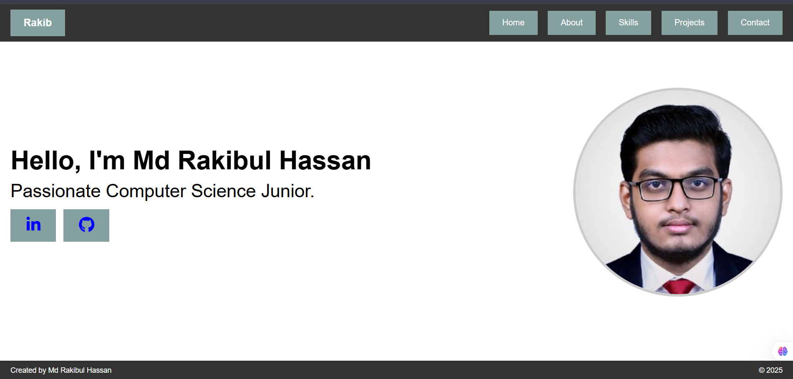

# <h1 align="center">My Personal Website </h1>

This a simple personal portfolio website.

## Technology Used
- **HTML5**
- **CSS**

---
## Screenshot



---

## Project Structure
```
BAIUST_COMPUTER_CLUB/

├── images/
| ├── Home_Page.png
| ├── Md_Rakibul_Hassan.jpg
├──about.html
├──contact.html
├──index.html
├──projects.html
├──README.md
├──skills.html
├──styles.css

```
---

## Built by
**Md Rakibul Hassan**

*Passionate Computer Science Junior* [LinkedIn](https://www.linkedin.com/in/md-rakibul-hassan-miyaji)  
Email: rakibulhassan0327@gmail.com  

## License

This project is open-source and free to use under the [MIT License](LICENSE).

---